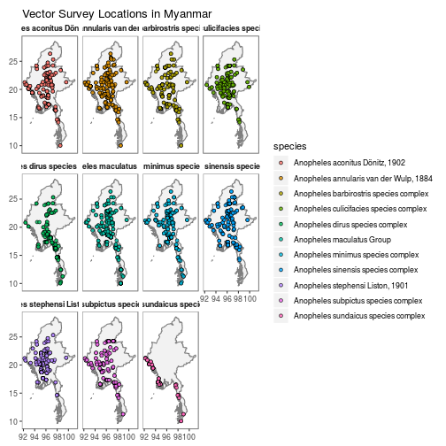
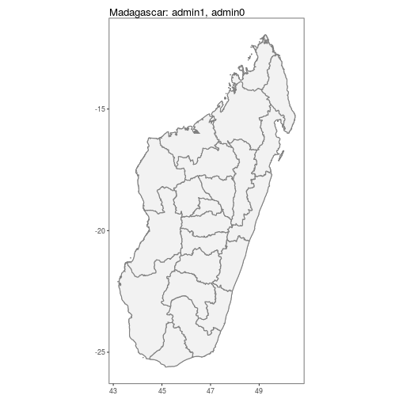
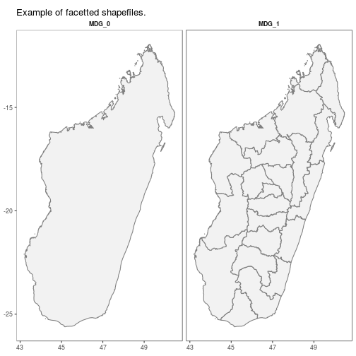
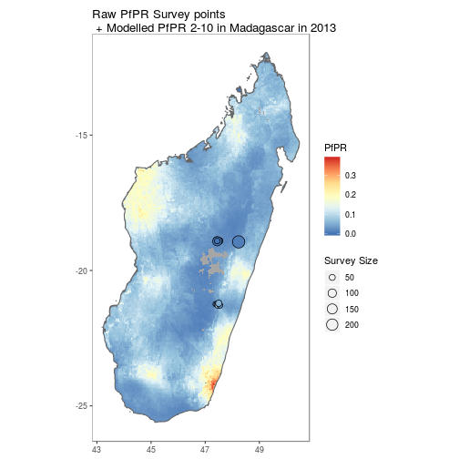
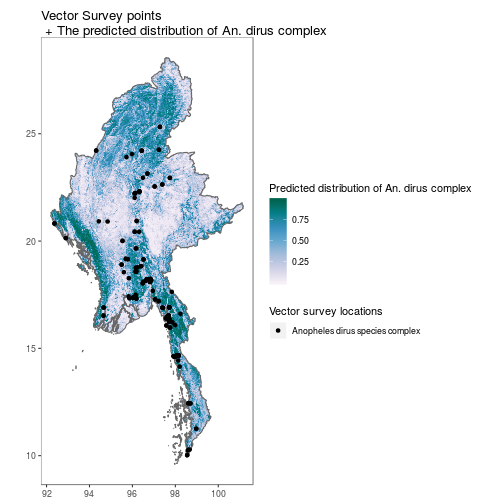

malariaAtlas
============

### An R interface to open-access malaria data, hosted by the Malaria Atlas Project.

This now includes our new global rasters for Plasmodium falciparum and P. vivax.

Please note that the new global rasters for PfPR is named "Plasmodium falciparum PR2 - 10" while the older, Africa only rasters are called "Plasmodium falciparum PR2-10". We're going to work out a better naming convention soon!

Overview
========

This package allows you to download parasite rate data (*Plasmodium
falciparum* and *P. vivax*), survey occurrence data of the 41 dominant
malaria vector species, and modelled raster outputs from the [Malaria
Atlas Project](https://map.ox.ac.uk/).

More details and example analyses can be found in the \[published
paper)\[(<https://malariajournal.biomedcentral.com/articles/10.1186/s12936-018-2500-5>).

Available Data:
---------------

The data can be explored at <https://map.ox.ac.uk/explorer/#/explorer>.

### list\* Functions

`listData()` retrieves a list of available data to download.

Use:

-   listData(datatype = “pr points”) OR listPoints(sourcedata = “pr
    points”) to see for which countries PR survey point data can be
    downloaded.

-   listData(datatype = “vector points”) OR listPoints(sourcedata =
    “vector points”) to see for which countries Vector survey data can
    be downloaded.

-   use listData(datatype = “rasters”) OR listRaster() to see rasters
    available to download.

-   use listData(datatype = “shape”) OR listShp() to see shapefiles
    available to download.

<!-- -->

    listData(datatype = "pr points")

    listData(datatype = "vector points")

    listData(datatype = "raster")

    ## Warning: package 'bindrcpp' was built under R version 3.4.4

    listData(datatype = "shape")

### is\_available

`isAvailable_pr` confirms whether or not PR survey point data is
available to download for a specified country.

Check whether PR data is available for Madagascar:

    isAvailable_pr(country = "Madagascar")

    ## Confirming availability of PR data for: Madagascar...

    ## PR points are available for Madagascar.

Check whether PR data is available for the United States of America

    isAvailable_pr(ISO = "USA")

    ## Confirming availability of PR data for: USA...

    ## Error in isAvailable_pr(ISO = "USA"): Specified location not found, see below comments: 
    ##  
    ## Data not found for 'USA', did you mean UGA OR SAU?

`isAvailable_vec` confirms whether or not vector survey point data is
available to download for a specified country.

Check whether vector data is available for Myanmar:

    isAvailable_vec(country = "Myanmar")

    ## Confirming availability of Vector data for: Myanmar...

    ## Vector points are available for Myanmar.

Downloading & Visualising Data:
-------------------------------

### get\* functions & autoplot methods

### Parasite Rate Survey Points

`getPR()` downloads all publicly available PR data points for a
specified country and plasmodium species (Pf, Pv or BOTH) and returns
this as a dataframe with the following format:

    MDG_pr_data <- getPR(country = "Madagascar", species = "both")

    ## Observations: 1,793
    ## Variables: 28
    ## $ dhs_id                    <fct> , , , , , , , , , , , , , , , , , , ...
    ## $ site_id                   <int> 6221, 6021, 15070, 15795, 7374, 1309...
    ## $ site_name                 <fct> Andranomasina, Andasibe, Ambohimarin...
    ## $ latitude                  <dbl> -18.7170, -19.8340, -18.7340, -19.76...
    ## $ longitude                 <dbl> 47.4660, 47.8500, 47.2520, 46.6870, ...
    ## $ rural_urban               <fct> , , , , , , , , , , rural, , , , , r...
    ## $ country                   <fct> Madagascar, Madagascar, Madagascar, ...
    ## $ country_id                <fct> MDG, MDG, MDG, MDG, MDG, MDG, MDG, M...
    ## $ continent_id              <fct> Africa, Africa, Africa, Africa, Afri...
    ## $ month_start               <int> 1, 3, 1, 7, 4, 1, 1, 7, 4, 7, 11, 4,...
    ## $ year_start                <int> 1987, 1987, 1987, 1995, 1986, 1987, ...
    ## $ month_end                 <int> 1, 3, 1, 8, 6, 1, 1, 8, 4, 8, 11, 6,...
    ## $ year_end                  <int> 1987, 1987, 1987, 1995, 1986, 1987, ...
    ## $ lower_age                 <dbl> 0, 0, 0, 2, 7, 0, 0, 2, 6, 2, 2, 7, ...
    ## $ upper_age                 <int> 99, 99, 99, 9, 22, 99, 99, 9, 12, 9,...
    ## $ examined                  <int> 50, 246, 50, 50, 119, 50, 50, 50, 20...
    ## $ positive                  <dbl> 0.075, 126.000, 0.025, 0.060, 37.000...
    ## $ pr                        <dbl> 0.0015, 0.5122, 0.0005, 0.0012, 0.31...
    ## $ species                   <chr> "P. falciparum", "P. falciparum", "P...
    ## $ method                    <fct> Microscopy, Microscopy, Microscopy, ...
    ## $ rdt_type                  <fct> , , , , , , , , , , , , , , , , , , ...
    ## $ pcr_type                  <lgl> NA, NA, NA, NA, NA, NA, NA, NA, NA, ...
    ## $ malaria_metrics_available <fct> true, true, true, true, true, true, ...
    ## $ location_available        <fct> true, true, true, true, true, true, ...
    ## $ permissions_info          <fct> , , , , , , , , , , , , , , , , , , ...
    ## $ citation1                 <fct> Lepers, J.P., Ramanamirija, J.A., An...
    ## $ citation2                 <fct> , , , , , , , , , , , , , , , , , , ...
    ## $ citation3                 <lgl> NA, NA, NA, NA, NA, NA, NA, NA, NA, ...

`autoplot.pr.points` configures autoplot method to enable quick mapping
of the locations of downloaded PR points.

    autoplot(MDG_pr_data)

A version without facetting is also available.

    autoplot(MDG_pr_data,
             facet = FALSE)

### Vector Survey Points

`getVecOcc()` downloads all publicly available Vector survey points for
a specified country and and returns this as a dataframe with the
following format:

    MMR_vec_data <- getVecOcc(country = "Myanmar")

    ## Observations: 2,866
    ## Variables: 24
    ## $ site_id        <int> 30243, 30243, 30243, 30243, 1000000072, 1000000...
    ## $ latitude       <dbl> 16.257, 16.257, 16.257, 16.257, 17.350, 17.380,...
    ## $ longitude      <dbl> 97.725, 97.725, 97.725, 97.725, 96.041, 96.037,...
    ## $ country        <fct> Myanmar, Myanmar, Myanmar, Myanmar, Myanmar, My...
    ## $ country_id     <fct> MMR, MMR, MMR, MMR, MMR, MMR, MMR, MMR, MMR, MM...
    ## $ continent_id   <fct> Asia, Asia, Asia, Asia, Asia, Asia, Asia, Asia,...
    ## $ month_start    <int> 2, 3, 8, 9, 5, 5, 5, 5, 5, 5, 5, 5, 5, 5, 5, 5,...
    ## $ year_start     <int> 1998, 1998, 1998, 1998, 1998, 1998, 1998, 1998,...
    ## $ month_end      <int> 2, 3, 8, 9, 3, 3, 3, 3, 3, 3, 3, 3, 3, 3, 3, 3,...
    ## $ year_end       <int> 1998, 1998, 1998, 1998, 2000, 2000, 2000, 2000,...
    ## $ anopheline_id  <int> 17, 17, 17, 17, 50, 49, 51, 4, 30, 17, 11, 15, ...
    ## $ species        <fct> Anopheles dirus species complex, Anopheles diru...
    ## $ species_plain  <fct> Anopheles dirus, Anopheles dirus, Anopheles dir...
    ## $ id_method1     <fct> unknown, unknown, unknown, unknown, morphology,...
    ## $ id_method2     <fct> , , , , , , , , , , , , , , , , , , , , , , , , 
    ## $ sample_method1 <fct> man biting, man biting, man biting, man biting,...
    ## $ sample_method2 <fct> animal baited net trap, animal baited net trap,...
    ## $ sample_method3 <fct> , , , , animal baited net trap, animal baited n...
    ## $ sample_method4 <fct> , , , , house resting inside, house resting ins...
    ## $ assi           <fct> , , , , , , , , , , , , , , , , , , , , , , , , 
    ## $ citation       <fct> Oo, T.T., Storch, V. and Becker, N. (2003).  <b...
    ## $ geom           <fct> POINT (16.257 97.725), POINT (16.257 97.725), P...
    ## $ time_start     <fct> 1998-02-01, 1998-03-01, 1998-08-01, 1998-09-01,...
    ## $ time_end       <fct> 1998-02-01, 1998-03-01, 1998-08-01, 1998-09-01,...

`autoplot.vector.points` configures autoplot method to enable quick
mapping of the locations of downloaded vector points.

    autoplot(MMR_vec_data)

N.B. Facet-wrapped option is also available for species stratification.

    autoplot(MMR_vec_data,
             facet = TRUE)

### Shapefiles

`getShp()` downloads a shapefile for a specified country (or countries)
and returns this as either a spatialPolygon or data.frame object.

    MDG_shp <- getShp(ISO = "MDG", admin_level = c("admin0", "admin1"))

    ## OGR data source with driver: ESRI Shapefile 
    ## Source: "/var/folders/y7/9cklsrvj5xv607jf59znfd2c0000gn/T//Rtmp3B1JQW/shp/shp74b548b1fcef/mapadmin_0_2018.shp", layer: "mapadmin_0_2018"
    ## with 1 features
    ## It has 8 fields
    ## OGR data source with driver: ESRI Shapefile 
    ## Source: "/var/folders/y7/9cklsrvj5xv607jf59znfd2c0000gn/T//Rtmp3B1JQW/shp/shp74b51d54d432/mapadmin_1_2018.shp", layer: "mapadmin_1_2018"
    ## with 22 features
    ## It has 12 fields

    ## Formal class 'SpatialPolygonsDataFrame' [package "sp"] with 5 slots
    ##   ..@ data       :'data.frame':  23 obs. of  16 variables:
    ##   .. ..$ iso          : Factor w/ 1 level "MDG": 1 1 1 1 1 1 1 1 1 1 ...
    ##   .. ..$ admn_level   : num [1:23] 0 1 1 1 1 1 1 1 1 1 ...
    ##   .. ..$ name_0       : Factor w/ 1 level "Madagascar": 1 1 1 1 1 1 1 1 1 1 ...
    ##   .. ..$ id_0         : num [1:23] 1e+07 1e+07 1e+07 1e+07 1e+07 ...
    ##   .. ..$ type_0       : Factor w/ 1 level "Country": 1 1 1 1 1 1 1 1 1 1 ...
    ##   .. ..$ name_1       : chr [1:23] NA "Androy" "Anosy" "Atsimo Andrefana" ...
    ##   .. ..$ id_1         : num [1:23] NA 1e+07 1e+07 1e+07 1e+07 ...
    ##   .. ..$ type_1       : chr [1:23] NA "Region" "Region" "Region" ...
    ##   .. ..$ name_2       : logi [1:23] NA NA NA NA NA NA ...
    ##   .. ..$ id_2         : logi [1:23] NA NA NA NA NA NA ...
    ##   .. ..$ type_2       : logi [1:23] NA NA NA NA NA NA ...
    ##   .. ..$ name_3       : logi [1:23] NA NA NA NA NA NA ...
    ##   .. ..$ id_3         : logi [1:23] NA NA NA NA NA NA ...
    ##   .. ..$ type_3       : logi [1:23] NA NA NA NA NA NA ...
    ##   .. ..$ source       : Factor w/ 1 level "Madagascar NMCP 2016": 1 1 1 1 1 1 1 1 1 1 ...
    ##   .. ..$ country_level: chr [1:23] "MDG_0" "MDG_1" "MDG_1" "MDG_1" ...
    ##   ..@ polygons   :List of 23
    ##   .. ..$ :Formal class 'Polygons' [package "sp"] with 5 slots
    ##   .. ..$ :Formal class 'Polygons' [package "sp"] with 5 slots
    ##   .. ..$ :Formal class 'Polygons' [package "sp"] with 5 slots
    ##   .. ..$ :Formal class 'Polygons' [package "sp"] with 5 slots
    ##   .. ..$ :Formal class 'Polygons' [package "sp"] with 5 slots
    ##   .. ..$ :Formal class 'Polygons' [package "sp"] with 5 slots
    ##   .. ..$ :Formal class 'Polygons' [package "sp"] with 5 slots
    ##   .. ..$ :Formal class 'Polygons' [package "sp"] with 5 slots
    ##   .. ..$ :Formal class 'Polygons' [package "sp"] with 5 slots
    ##   .. ..$ :Formal class 'Polygons' [package "sp"] with 5 slots
    ##   .. ..$ :Formal class 'Polygons' [package "sp"] with 5 slots
    ##   .. ..$ :Formal class 'Polygons' [package "sp"] with 5 slots
    ##   .. ..$ :Formal class 'Polygons' [package "sp"] with 5 slots
    ##   .. ..$ :Formal class 'Polygons' [package "sp"] with 5 slots
    ##   .. ..$ :Formal class 'Polygons' [package "sp"] with 5 slots
    ##   .. ..$ :Formal class 'Polygons' [package "sp"] with 5 slots
    ##   .. ..$ :Formal class 'Polygons' [package "sp"] with 5 slots
    ##   .. ..$ :Formal class 'Polygons' [package "sp"] with 5 slots
    ##   .. ..$ :Formal class 'Polygons' [package "sp"] with 5 slots
    ##   .. ..$ :Formal class 'Polygons' [package "sp"] with 5 slots
    ##   .. ..$ :Formal class 'Polygons' [package "sp"] with 5 slots
    ##   .. ..$ :Formal class 'Polygons' [package "sp"] with 5 slots
    ##   .. ..$ :Formal class 'Polygons' [package "sp"] with 5 slots
    ##   ..@ plotOrder  : int [1:23] 1 4 17 15 14 3 8 7 20 12 ...
    ##   ..@ bbox       : num [1:2, 1:2] 43.2 -25.6 50.5 -11.9
    ##   .. ..- attr(*, "dimnames")=List of 2
    ##   ..@ proj4string:Formal class 'CRS' [package "sp"] with 1 slot

`autoplot.MAPshp` configures autoplot method to enable quick mapping of
downloaded shapefiles.

    MDG_shp <- as.MAPshp(MDG_shp)
    autoplot(MDG_shp)

N.B. Facet-wrapped option is also available for species stratification.

    autoplot(MDG_shp,
             facet = TRUE,
             map_title = "Example of facetted shapefiles.")

### Modelled Rasters

`getRaster()`downloads publicly available MAP rasters for a specific
surface & year, clipped to a given bounding box or shapefile

    MDG_shp <- getShp(ISO = "MDG", admin_level = "admin0")
    MDG_PfPR2_10 <- getRaster(surface = "Plasmodium falciparum PR2-10", shp = MDG_shp, year = 2013)

N.B. to use downloaded rasters and shapefiles directly with autoplot,
use as.MAPraster() and as.MAPshp() to convert these to data.frames.
Alternatively autoplot\_MAPraster() will work directly with RasterLayer,
RasterStack or RasterBrick objects downloaded with getRaster().

`autoplot.MAPraster`&`autoplot_MAPraster`configures autoplot method to
enable quick mapping of downloaded rasters.

    MDG_PfPR2_10_df <- as.MAPraster(MDG_PfPR2_10)
    MDG_shp_df <- as.MAPshp(MDG_shp)
    p <- autoplot(MDG_PfPR2_10_df, shp_df = MDG_shp_df)

### Combined visualisation

By using the above tools along with ggplot, simple comparison figures
can be easily produced.

    MDG_shp <- getShp(ISO = "MDG", admin_level = "admin0")
    MDG_shp_df <- as.MAPshp(MDG_shp)
    MDG_PfPR2_10 <- getRaster(surface = "Plasmodium falciparum PR2-10", shp = MDG_shp, year = 2013)
    MDG_PfPR2_10_df <- as.MAPraster(MDG_PfPR2_10)

    p <- autoplot(MDG_PfPR2_10_df, shp_df = MDG_shp_df, printed = FALSE)

    pr <- getPR(country = c("Madagascar"), species = "Pf")
    p[[1]] +
    geom_point(data = pr[pr$year_start==2013,], aes(longitude, latitude, fill = positive / examined, size = examined), shape = 21)+
    scale_size_continuous(name = "Survey Size")+
     scale_fill_distiller(name = "PfPR", palette = "RdYlBu")+
     ggtitle("Raw PfPR Survey points\n + Modelled PfPR 2-10 in Madagascar in 2013")

Similarly for vector survey data

    MMR_shp <- getShp(ISO = "MMR", admin_level = "admin0")
    MMR_shp_df <- as.MAPshp(MMR_shp)
    MMR_An_dirus <- getRaster(surface = "Anopheles dirus species complex", shp = MMR_shp)
    MMR_An_dirus_df <- as.MAPraster(MMR_An_dirus)

    p <- autoplot(MMR_An_dirus_df, shp_df = MMR_shp_df, printed = FALSE)

    vec <- getVecOcc(country = c("Myanmar"), species = "Anopheles dirus")
    p[[1]] +
    geom_point(data = vec, aes(longitude, latitude, colour = species))+
      scale_colour_manual(values = "black", name = "Vector survey locations")+
     scale_fill_distiller(name = "Predicted distribution of An. dirus complex", palette = "PuBuGn", direction = 1)+
     ggtitle("Vector Survey points\n + The predicted distribution of An. dirus complex")

Basic Spatial utility tools
---------------------------

### extractRaster
